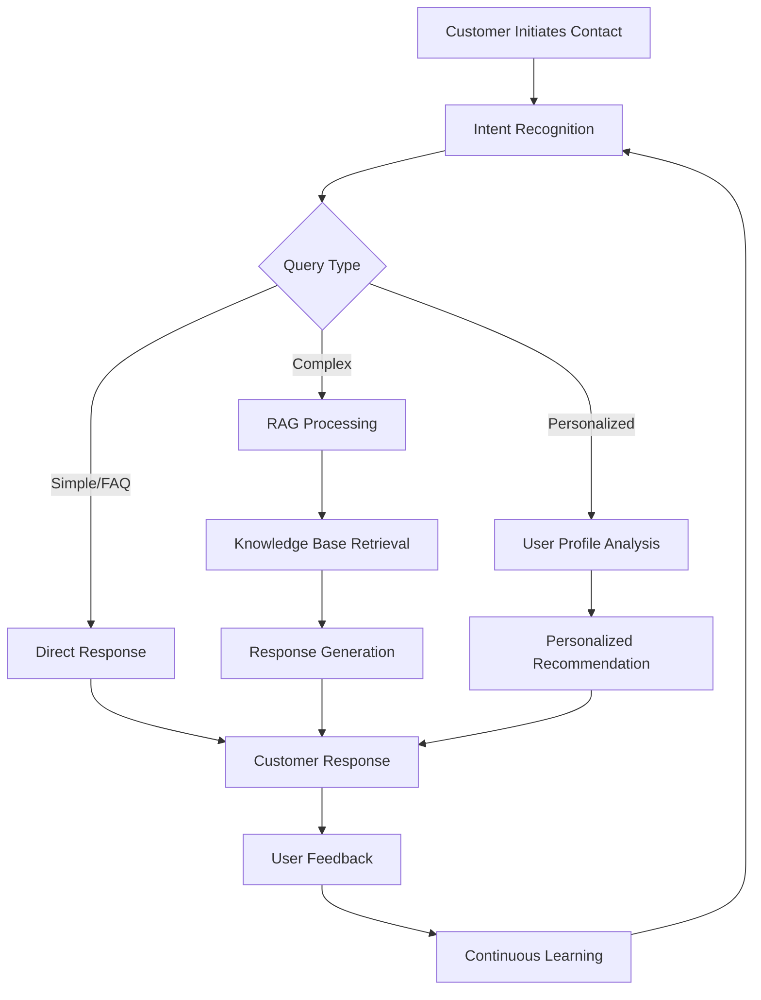
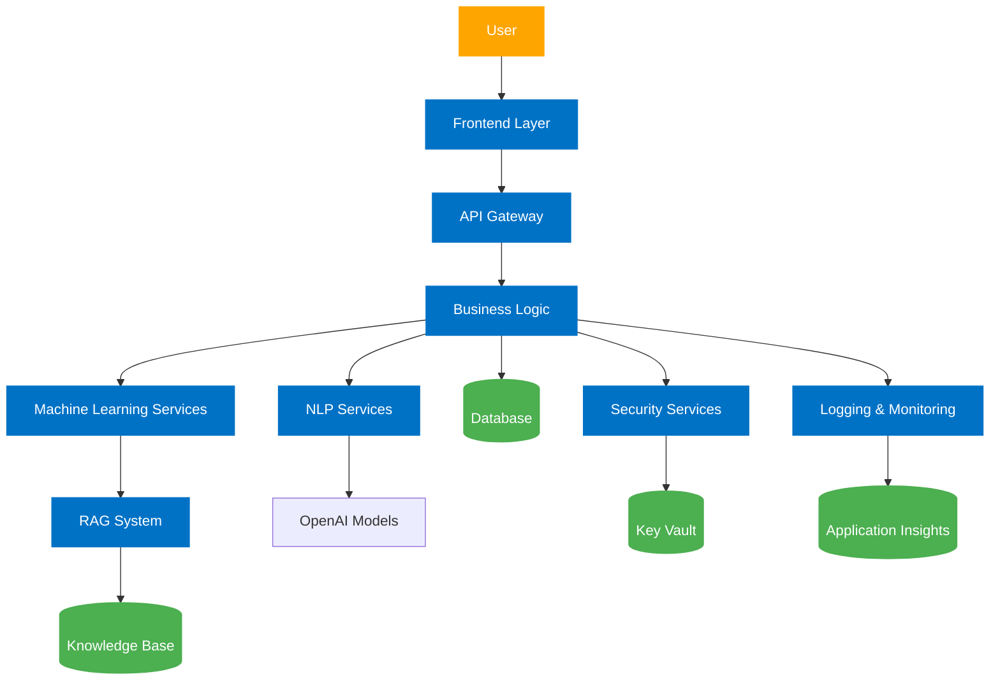

# 🏦 BoBuddy: Generative AI for Banking Excellence 🤖

  

## 📋 Table of Contents

- [🎯 Problem Statement](#-problem-statement)
- [💡 Solution Overview](#-solution-overview)
- [✨ Key Features](#-key-features)
- [🏗️ Technical Architecture](#️-technical-architecture)
- [🛠️ Tools and Resources](#️-tools-and-resources)
- [🚀 Differentiators](#-differentiators)
- [💼 Business Potential](#-business-potential)
- [👥 User Experience](#-user-experience)
- [📈 Scalability](#-scalability)
- [🔒 Security Considerations](#-security-considerations)
- [🚀 Deployment and Maintenance](#-deployment-and-maintenance)
- [🔮 Future Scope](#-future-scope)
- [📊 Impact Metrics](#-impact-metrics)
- [👨‍💻 Team Members](#-team-members)

## 🎯 Problem Statement

> "How might we reimagine customer service at Bank of Baroda through generative AI to deliver personalized, efficient, and seamless support across channels?"

### 🔍 Challenges Addressed:

| Challenge | Description | Priority |
|-----------|-------------|----------|
| **Real-time Automation** | Automate customer inquiries with accurate, contextual responses | High |
| **Personalization** | Deliver tailored recommendations using comprehensive customer data | High |
| **Integration** | Seamlessly connect with existing service platforms | Medium |
| **Security & Privacy** | Uphold stringent standards of data protection | Critical |
| **Multilingual Support** | Cater to diverse customer base across languages | Medium |
| **Scalability** | Handle varying volumes of inquiries efficiently | High |

## 💡 Solution Overview

**BoBuddy** is a cutting-edge AI-powered customer service solution that transforms how Bank of Baroda engages with customers. By harnessing the power of generative AI, natural language processing, and machine learning, BoBuddy delivers:

1. 🤝 **Personalized customer interactions** tailored to individual preferences and history
2. ⚡ **Efficient query resolution** with 24/7 availability and instant responses
3. 📊 **Data-driven insights** for continuous service improvement
4. 💰 **Cost reduction** through automation of routine inquiries
5. 🌐 **Seamless multi-channel support** across web, mobile, and voice interfaces
6. 🔮 **Proactive engagement** with customers for enhanced relationship management

<blockquote>
BoBuddy isn't just another chatbot - it's a comprehensive banking assistant designed to understand, learn, and evolve with your customers' needs.
</blockquote>

## ✨ Key Features

### 🗣️ Communication Features
- **Multilingual Support**: Handles 60+ languages for India's diverse customer base
- **Voice Input & Output**: Natural speech recognition and synthesis for hands-free interaction
- **File Upload Capability**: Secure document processing for efficient service delivery
- **Multi-Channel Integration**: Consistent experience across web, mobile, voice, and SMS

### 🧠 Intelligence Features
- **Hyper-Personalization**: Leverages customer data for tailored interactions
- **RAG Architecture**: Retrieval-Augmented Generation for accurate knowledge-based responses
- **Context Awareness**: Maintains conversation history and user preferences
- **Intent Recognition**: Accurately identifies customer needs even from complex queries

### 🔧 Technical Features
- **Advanced NLP Integration**: Built on OpenAI's GPT models enhanced with domain-specific training
- **Azure Cognitive Search**: Powers the RAG implementation for document retrieval
- **Secure Processing**: End-to-end encryption and privacy-preserving architecture
- **Real-time Analytics**: Continuous performance monitoring and improvement

## 🏗️ Technical Architecture

### 📱 Frontend Layer
- **User Interface**: React.js web application & React Native mobile app
- **Chatbot Interface**: Azure Bot Framework with custom UI components
- **Voice Interface**: Speech-to-Text & Text-to-Speech services

### ⚙️ Backend Layer
- **API Gateway**: Azure API Management for unified API access
- **Business Logic**: Microservices architecture on Azure App Service
- **Orchestration**: Azure Functions & Logic Apps for workflow automation

### 💾 Data Layer
- **Structured Data**: Azure SQL Database for customer records
- **Unstructured Data**: Azure Blob Storage for documents & files
- **Caching**: Redis Cache for performance optimization

### 🧠 AI and NLP Layer
- **Core LLM**: OpenAI GPT-4 with domain fine-tuning
- **RAG Implementation**: Azure Cognitive Search with vector embeddings
- **Customer Understanding**: Custom intent classification models

  <table>
    <tr>
      <th colspan="2">Technical Stack Components</th>
    </tr>
    <tr>
      <td><strong>Frontend</strong></td>
      <td>React.js, React Native, Bot Framework Web Chat</td>
    </tr>
    <tr>
      <td><strong>Backend</strong></td>
      <td>Node.js, Azure Functions, Logic Apps</td>
    </tr>
    <tr>
      <td><strong>Data Storage</strong></td>
      <td>Azure SQL, Blob Storage, Redis Cache</td>
    </tr>
    <tr>
      <td><strong>AI/ML</strong></td>
      <td>OpenAI GPT-4, Azure Cognitive Services, Custom ML Models</td>
    </tr>
    <tr>
      <td><strong>DevOps</strong></td>
      <td>GitHub Actions, Azure DevOps, Terraform</td>
    </tr>
    <tr>
      <td><strong>Security</strong></td>
      <td>Azure AD, Key Vault, TLS/SSL, Data Encryption</td>
    </tr>
  </table>

### 📊 Architecture Diagram

## 🛠️ Tools and Resources

### 🔹 Azure Services
- **Azure App Service**: Hosting web applications
- **Azure Bot Service**: Managing conversational experiences
- **Azure Cognitive Services**: AI capabilities for language, speech, vision
- **Azure AI Search**: Powering the RAG implementation
- **Azure Machine Learning**: Custom model development and deployment
- **Azure SQL Database**: Secure data storage
- **Azure Active Directory**: Authentication and authorization
- **Azure Key Vault**: Secret management
- **Azure Monitor & Application Insights**: Observability

### 🔹 Development Tools
- **GitHub**: Source code management and CI/CD
- **Visual Studio Code**: Development environment
- **Postman**: API testing
- **Docker**: Containerization
- **Terraform**: Infrastructure as Code

### 🔹 AI & ML Frameworks
- **OpenAI GPT**: Core language model
- **TensorFlow/PyTorch**: Custom ML model development
- **langchain**: RAG implementation
- **sentence-transformers**: Vector embeddings

## 🚀 Differentiators

What sets BoBuddy apart from existing solutions:

| Differentiator | Description | Impact |
|----------------|-------------|--------|
| **Advanced RAG** | Combines generative AI with retrieval for accurate responses | Higher customer satisfaction |
| **Personalization Engine** | Tailors interactions based on customer profiles and history | Improved relationship management |
| **Domain Expertise** | Specialized in banking context, regulations, and procedures | Reduced error rates |
| **Multilingual Excellence** | Native support for Indian languages with cultural nuances | Broader customer reach |
| **Omnichannel Consistency** | Uniform experience across all touchpoints | Enhanced brand perception |
| **Privacy-first Design** | Built with data protection principles | Increased trust and compliance |

## 💼 Business Potential

### 📊 ROI Metrics

- **Cost Reduction**: 30-40% reduction in customer service operational costs
- **Efficiency**: 65% faster resolution times for customer queries
- **Coverage**: 24/7 availability increasing service window by 3x
- **Scalability**: Ability to handle 10x inquiry volume with minimal additional cost
- **Cross-selling**: 15-20% increase in product recommendations conversion

### 💹 Business Value

1. **Enhanced Customer Experience**
   - Reduced wait times from minutes to seconds
   - Consistent service quality across all interactions
   - Personalized engagement increasing satisfaction scores

2. **Operational Excellence**
   - Automation of routine inquiries (60-70% of total volume)
   - Digital-first approach reducing physical paperwork
   - Data-driven insights for service improvement

3. **Competitive Advantage**
   - First-mover advantage in AI-powered banking services
   - Technology leadership positioning in the market
   - Attraction of tech-savvy customer segments

## 👥 User Experience

### 🧑‍💼 Customer Journey Touchpoints

1. **Discovery**: Web/mobile app integration with prominent visibility
2. **Onboarding**: Simple introduction and guided first interaction
3. **Daily Usage**: Quick access to common banking tasks and information
4. **Problem Resolution**: Seamless escalation paths when needed
5. **Feedback Loop**: Continuous improvement through user input

### 🎨 UI/UX Principles

- **Simplicity**: Clean, intuitive interface requiring minimal learning
- **Accessibility**: WCAG compliance for users with disabilities
- **Responsiveness**: Adaptive design for all device types
- **Personality**: Friendly, professional tone with bank branding
- **Transparency**: Clear indication of AI capabilities and limitations

## 📈 Scalability

### 🔄 Technical Scalability

- **Horizontal Scaling**: Auto-scaling infrastructure based on demand
- **Asynchronous Processing**: Queue-based architecture for peak handling
- **Caching Strategy**: Multi-level caching for performance optimization
- **Load Distribution**: Geographic distribution of resources

### 🌱 Growth Scalability

- **Module Expansion**: Modular design allowing new capabilities
- **Language Addition**: Framework for incorporating additional languages
- **Knowledge Augmentation**: Process for expanding the knowledge base
- **Channel Integration**: Architecture supporting new interaction channels

## 🔒 Security Considerations

### 🛡️ Data Protection

- **Encryption**: End-to-end encryption for all data (transit and rest)
- **Tokenization**: Sensitive information handling through tokenization
- **Data Minimization**: Processing only necessary information
- **Retention Policies**: Clear guidelines on data storage duration

### 🔐 Access Control

- **Authentication**: Multi-factor authentication for all access
- **Authorization**: Role-based access control (RBAC)
- **Audit Trails**: Comprehensive logging of all system activities
- **Session Management**: Secure session handling with timeouts

### 🔍 Compliance

- **Regulatory Adherence**: Built to meet RBI guidelines and banking regulations
- **GDPR Principles**: Privacy by design and data subject rights
- **Ethical AI**: Fairness, transparency, and bias mitigation
- **Regular Audits**: Scheduled security assessments and penetration testing

## 🚀 Deployment and Maintenance

### 📊 Deployment Strategy

- **Phased Rollout**: Staged implementation beginning with controlled user groups
- **Canary Deployments**: Risk minimization through gradual feature releases
- **Blue-Green Deployments**: Zero-downtime updates
- **Rollback Capabilities**: Quick recovery options for any issues

### 🔧 Maintenance Approach

- **Monitoring**: Real-time performance and health tracking
- **DevOps**: Continuous integration and delivery pipeline
- **SLA Commitment**: 99.9% uptime guarantee
- **Support Tiers**: Multi-level support structure for issue resolution

## 🔮 Future Scope

### 🚀 Short-term Evolution (6-12 months)

- **Advanced Analytics Dashboard**: In-depth insights for bank management
- **Expanded Transaction Capabilities**: More self-service banking options
- **Enhanced Personalization**: Deeper integration with customer profiles
- **Voice Biometrics**: Additional security through voice recognition

### 🌠 Long-term Vision (1-3 years)

- **Predictive Banking**: Anticipating customer needs before they arise
- **Financial Wellness Coach**: AI-powered financial planning advice
- **Cross-Product Intelligence**: Unified recommendations across all bank offerings
- **Emotional Intelligence**: Understanding and responding to customer sentiment
- **Augmented Reality Integration**: Visual interfaces for complex banking tasks

## 📊 Impact Metrics

### 📈 Customer Impact

- **Customer Satisfaction**: Target NPS improvement of 15-20 points
- **Resolution Rate**: 85%+ first-contact resolution
- **Adoption Rate**: 60%+ of digital customers using BoBuddy regularly
- **Engagement Time**: 3x increase in digital banking session duration

### 💰 Business Impact

- **Cost Savings**: ₹100+ crore annual operational cost reduction
- **Revenue Growth**: 12-15% increase in digital channel conversions
- **Efficiency Gain**: 40% reduction in average handling time
- **Knowledge Capture**: 95% of institutional knowledge digitized and accessible

## 👨‍💻 Team Members

| Name | Role | Expertise |
|------|------|-----------|
| Yash Kavaiya | Project Lead | AI/ML, Solution Architecture |
| Team Member 2 | Frontend Developer | React, UI/UX Design |
| Team Member 3 | Backend Developer | Azure, Microservices |
| Team Member 4 | Data Scientist | NLP, Machine Learning |
| Team Member 5 | Quality Assurance | Testing, User Experience |

---

  <h3>🏆 Bank of Baroda Hackathon 2024 - Team InnovateBOB</h3>
  
Transforming banking interactions through the power of generative AI

